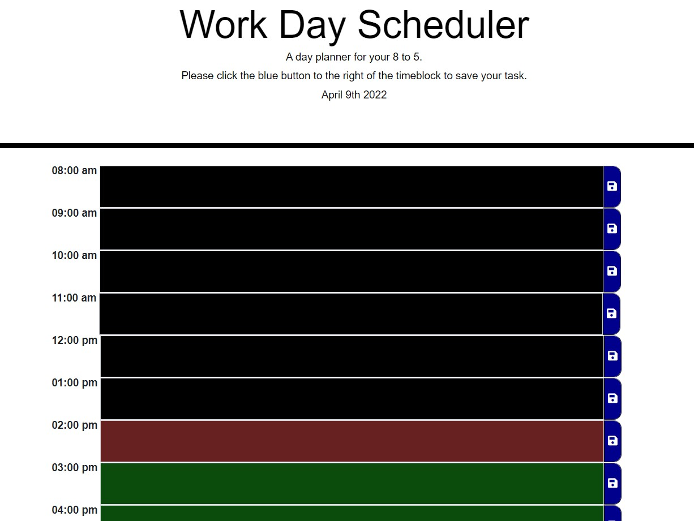

# homework-5

## 05: Work Day Scheduler

This project is built to provide a daily planner for important events to employees with busy schedules so that they can manage their time effectively.

## Mock-up

## Installation

The code quiz is here: https://matthewestes33.github.io/homework-5/

All elements of the project can be examined here: https://github.com/matthewestes33/homework-5

## Credits

Referenced tutorials:

Bootstrap 4 Input Groups: https://www.w3schools.com/bootstrap4/bootstrap_forms_input_group.asp

Bootstrap Form Inputs: https://www.w3schools.com/bootstrap/bootstrap_forms_inputs.asp

Grid System: https://getbootstrap.com/docs/4.0/layout/grid/

.each(): https://api.jquery.com/each/

jQuery.parseJSON(): https://api.jquery.com/jquery.parsejson/

parseInt(): https://developer.mozilla.org/en-US/docs/Web/JavaScript/Reference/Global_Objects/parseInt

## Features

The employee is provided with a single-page daily planner with the correct day auto-generated at the top of the page.

The daily planner has timeblocks for standard business hours, in one-hour increments. 

During business hours, each time block is a different color, which indicates whether the timeblock is in the past, present, or future.

When the employee clicks into the timeblock, it changes to a different color to indicate that it can accept entry of text.

When the employee clicks the blue save button that corresponds to the timeblock, the text entered is saved in local storage.

The saved text persists even when the user refreshes the page, due to the local storage.
